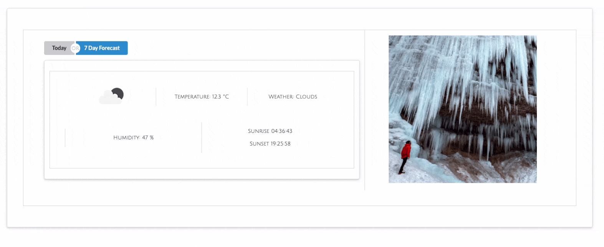

# SEI Project 3: The Natural Wanderer

## Table of Contents
Overview<br/>
[Brief & Timeframe](#brief) <br/>
[Link to Project & Installation](#project) <br/>
[Technologies used](#technologies-used) <br/>
[Development (screenshots & featured code)](#development) <br/>
[Wins and Challenges](#wins)<br/>
[Future improvements](#improvements)<br/>
[Key learnings](#learnings)<br/>

## Overview
The Natural Wanderer was my third project at GA and was a group project with two other people (Jonathan Ward and Michael Edwards). With our movements and travel restricted somewhat over the past year, our thoughts were firmly on being outside and within nature - hence curating a list of fascinating national parks across the globe that we could plan to visit at some point in the not-too-distant future! It is a full-stack MERN app with CRUD functionality, where users can register and save parks to their account. Some features are not available unless logged in and if users are, they can comment and add specific recommendations for each park.


## <a name="brief"></a>Brief  
* Build a full-stack application by making your own backend and your own front-end
* Use an Express API to serve your data from a Mongo database
* Consume your API with a separate front-end built with React
* Be a complete product which most likely means multiple relationships and CRUD functionality for at least a couple of models
* Implement thoughtful user stories/wireframes that are significant enough to help you know which features are core MVP and which you can cut

## Timeframe
1 week

## <a name="project"></a> Link to deployed project 
https://natural-wanderer.netlify.app/

## Code installation 
* Clone or download the repo
* Ensure MongoDB is running by running the following command in your terminal: mongod --dbpath ~/data/db
* Get backend up and running by navigating to the backend folder: cd backend
* Run yarn && yarn seed 
* Start server with: yarn serve
* Navigate to the frontend: cd client
* Run yarn to install dependencies 
* Start frontend server with: yarn start

## <a name="technologies-used"></a>Technologies used
* MongoDB & Mongoose
* React.js & React Hooks
* Express
* Node.js
* JavaScript
* Axios
* jsonwebtoken
* bcrypt
* Mapbox
* OpenWeatherMap
* Semantic React UI
* Git/GitHub
* Netlify
* Heroku

## <a name="development"></a>Development 💻

### Planning
We all knew that the more time spent planning out our schemas, relationships and how we wanted the site to look, the easier it would be to get going with coding, so we took the whole of the first day discussing this and using Miro, Figma and Google Docs to help. Below is our initial plan of the user journey shown on Miro. The fact that we could all work on the same doc simultaneously was really useful. 


Having the user’s journey depicted pretty clearly helped with formulating the models for the park and user. 


We also set up a Trello board, which proved to be invaluable as the week went on. Along with our daily project standups where we divided up tasks by priority level, this helped us all easily see who was working on what and ensured there was no overlap or confusion as to where we were all at. With us all working remotely we knew we had to stay on top of communication and these were our most useful tools.


### Process
After our extensive planning on Day 1, we were ready to start building out our backend on Day 2. We wanted to get the majority of the backend and routes set up before we started with the frontend so that we could test all of the endpoints through Insomnia thoroughly and make sure we were getting all of the information back that we were expecting. In terms of functionality, we used CRUD for our models’ routes. We had already planned to all work full-stack so we split out tasks evenly based on priority and logical order for functionality. Some areas I personally worked on were authentication and the user profile page and the edit functionality that goes with it. As it turns out, we managed to complete the initial build of the backend by the end of Day 3. 

```
const commentSchema = new mongoose.Schema({
 text: { type: String, required: true, maxLength: 500 },
 rating: { type: Number, required: true, min: 1, max: 5 },
 owner: { type: mongoose.Schema.ObjectId, ref: 'User' }
}, {
 timestamps: true
})
 
 
const recommendationsSchema = new mongoose.Schema({
 parkName: { type: String },
 activity: { type: String, required: true },
 text: { type: String, required: true },
 image: { type: String },
 owner: { type: mongoose.Schema.ObjectId, ref: 'User', required: true }
}, {
 timestamps: true
})
 
const nationalParkSchema = new mongoose.Schema({
 name: { type: String, required: true, unique: true },
 image: [{ type: String, required: true }],
 description: { type: String, required: true },
 latitude: { type: Number },
 longitude: { type: Number },
 region: { type: String, required: true },
 country: { type: String, required: true },
 facts: [{ type: String, required: true }],
 comments: [commentSchema],
 recommendations: [recommendationsSchema],
 parkUrl: { type: String }
})
```

One focus point which carried through most days for all of us was the collection and creation of data to make up our seeds file of national parks. As our app was featuring parks from all over the world we split out the regions and each took two, then researched information for our respective regions in the evenings after most of the coding was done for the day. 

Day 4 saw us moving on to the frontend build, which we built with React, specifically React Hooks. We made use of the HTTP-proxy-middleware to link back- and frontend and nodemon’s hot-reloading of the browser to quickly see changes as we worked.  

As with the backend, we split the work as necessary and inevitably worked on all areas of the app at different points to ensure we had a solid understanding of all working parts. However, I started the frontend focused on the user journey, first by adding register and login pages to enable some of the features that would require authentication, and then working on the user profile account. I also worked on the regions show page which dynamically switches images for each region every 4 seconds using a slider. 

We fetched all necessary data using axios and set it to state so that it could be used in various places:

```
useEffect(() => {
    const userInfo = async () => {
      const response = await axios.get(`/api/profile/${params.id}`)
      setUserData(response)
      const allParks = await axios.get('/api/parks/') 
      setParksData(allParks)
    }
    userInfo()
  }, [confirm])
  ```
  
 We used two external APIs for this project, one to embed maps and the other to show the current and 7-day weather forecast:
 
 Map:
 
 
 Weather:
 

One other feature I added towards the end of the week was the donation section that sits on the homepage, which, had there been more time, I would have linked to the user’s account. As it stands it’s a simple interactive section where the user can ‘donate’ a given amount or generate a random amount. They’ll be asked if they’re happy to proceed with that random amount and if they click yes it’s added to the total, but if not, it doesn’t and the random amount falls back to zero. 


Lastly, styling. We decided to use a CSS framework that none of us had any experience with: Semantic React UI. This meant getting to grips with the documentation very quickly! It took us a few tries to get comfortable with it but it worked for our clean and minimalist style we wanted for the site. It was a great experience using a different framework to my last project and particularly like the various animated elements Semantic offers. 


## <a name="wins"></a>Wins and Challenges

### Challenges
Getting the map toggle section to show on the parks show page proved troublesome due to the many docs and posts related to this. It was sorted with just an hour to spare before the end of project week! Only for the beginning of the project was using Git as a team challenging. We got over the fear of merge conflicts pretty quickly mainly due to our decision at the start to always come together as a group when we wanted to merge, which meant we could resolve any conflicts straight away. 


### Wins 🎉
Building a fully functioning full-stack app in a group! More specifically, creating an app with the amount of functionality that we had with only three members in the team was definitely a win. Plus, it was my first foray into using Git as a group and, whilst this is also part of the challenges section, I feel it went more positively than negatively and meant we had to learn very quickly how to use it productively. Communication was key. I’m also pleased with the overall styling and look of our site. 


## <a name="improvements"></a>Future improvements 
Overall, I’m very happy with how this project turned out but there’s always room for improvement and more functionality! Given more time, I would:
* add info for hiking trails specific to those parks or incorporating a language translation API
* link the donations section on the homepage to a user’s account so they can see how much they’ve donated and when
* think about how to optimise the site for speed, with lots of images loading times can sometimes be slow
* more user feedback, for instance when a user adds a park to their wishlist there should be some kind of feedback response.


## <a name="learnings"></a> Key learnings ✨
Working in a group and all that that entails: effective communication, successful use of project management tools such as Trello, as well as planning tools such as Miro and Figma. I’m also more comfortable with the difference between embedded and referenced relationships now. 
